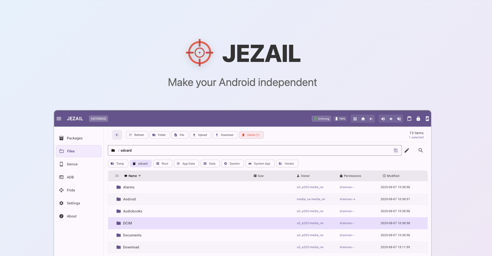

<div align="center">
  <br>
  
  

  <br>
  <br>

<!--  -->


</div>

## What is JEZAIL

Jezail is a powerful, **all-in-one Android application** that runs entirely on your rooted device, transforming it into a comprehensive security testing and device management platform. 

It allows you to remotely manage and control your Android device, deploy security tools, and conduct penetration testing through its rich **REST API** or an intuitive **Flutter-based web interface** that comes pre-embedded with the application.

With deep system access, Jezail operates without external dependencies or complicated setups. The locally served web UI is accessible from any device on your network, providing professional-grade functionality for application management, system control, and security assessments directly from your Android device.


----


| Document | Description |
|----------|-------------|
| [FEATURES.md](./FEATURES.md) | Complete feature list and current capabilities |
| [ROADMAP.md](./ROADMAP.md) | Development roadmap and planned features |
| [UI.md](./UI.md) | Web interface documentation |
| [docs/screenshots/](./docs/screenshots) | UI previews and feature demonstrations |


## Installation

### Prerequisites

- **Rooted Android Device**: Full system access required for device management capabilities
  - Recommended: [Magisk](https://github.com/topjohnwu/Magisk) for modern Android devices
  - Emulator users: Use [rootAVD](https://gitlab.com/newbit/rootAVD) for rooting

### Quick Install

1. Download the latest APK from [Releases](https://github.com/zahidaz/jezail/releases)
2. Install with ADB:
   ```bash
   adb install -g -r jezail.apk
   ```
3. Launch Jezail (auto-starts HTTP server on 8080)
4. Access the interface:
   ```
   http://<device-ip>:8080/         # Flutter Web UI
   http://<device-ip>:8080/api/json # Complete API JSON
   http://<device-ip>:8080/api/swagger # API Documentation
   ```

### Emulator Setup

When running on an emulator, forward the port to your host:
```bash
adb forward tcp:8080 tcp:8080
```
Then access via `http://localhost:8080`


## API Reference

Jezail provides a complete REST API for programmatic access:

- **Swagger UI**: `http://<device-ip>:8080/api/swagger`
- **JSON Schema**: `http://<device-ip>:8080/api/json`
- **Interactive Documentation**: Available through the web interface


## Contributing

We welcome contributions from the community.


## About the Name

Jezail is a traditional long-barreled rifle from Afghanistan used mainly in the 19th century. It was handmade and often decorated, featuring a long, heavy barrel that made it very accurate and powerful over long distances. Its unique curved wooden stock allowed fighters to shoot comfortably from different positions, including on horseback.

The Jezail rifle was key in historic battles because it could hit targets much farther away than typical guns of that time. The Jezail Android Pentesting Toolkit takes its name from this powerful and precise weapon, reflecting its goal to provide strong, accurate, and versatile security tools that run fully on Android devices.

## Disclaimer

Jezail is currently under active development and may contain incomplete features or bugs. It is provided "as is" without any warranty of any kind, either expressed or implied. Users assume full responsibility for any risks or issues that arise from using the toolkit. Jezail is intended for use by experienced users who understand the risks associated with running powerful tools on rooted Android devices.

## License

This project is licensed under the MIT License - see the [LICENSE](./LICENSE) file for details.
