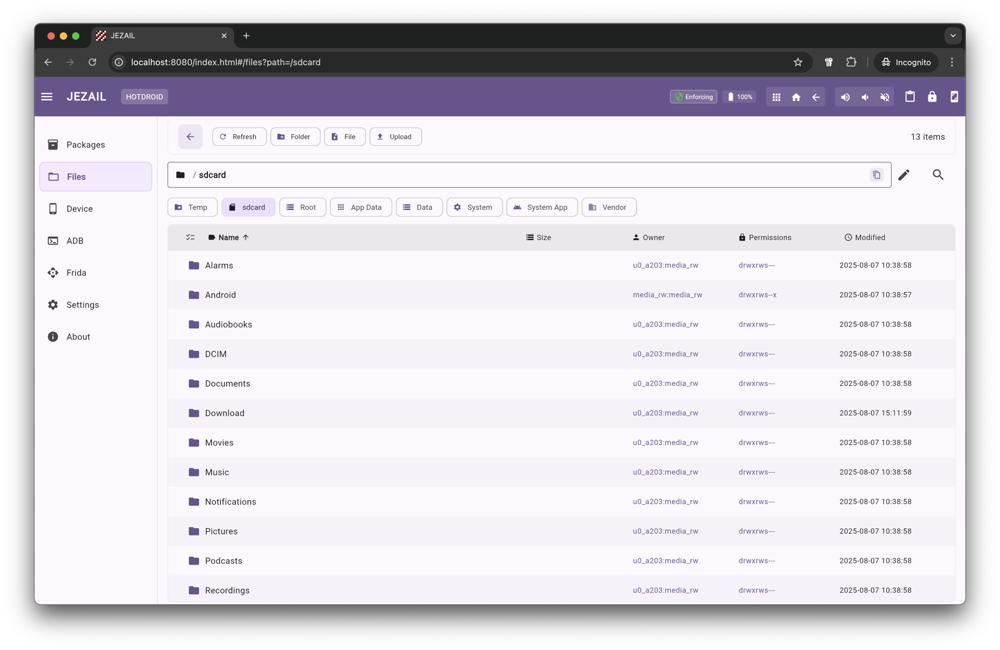
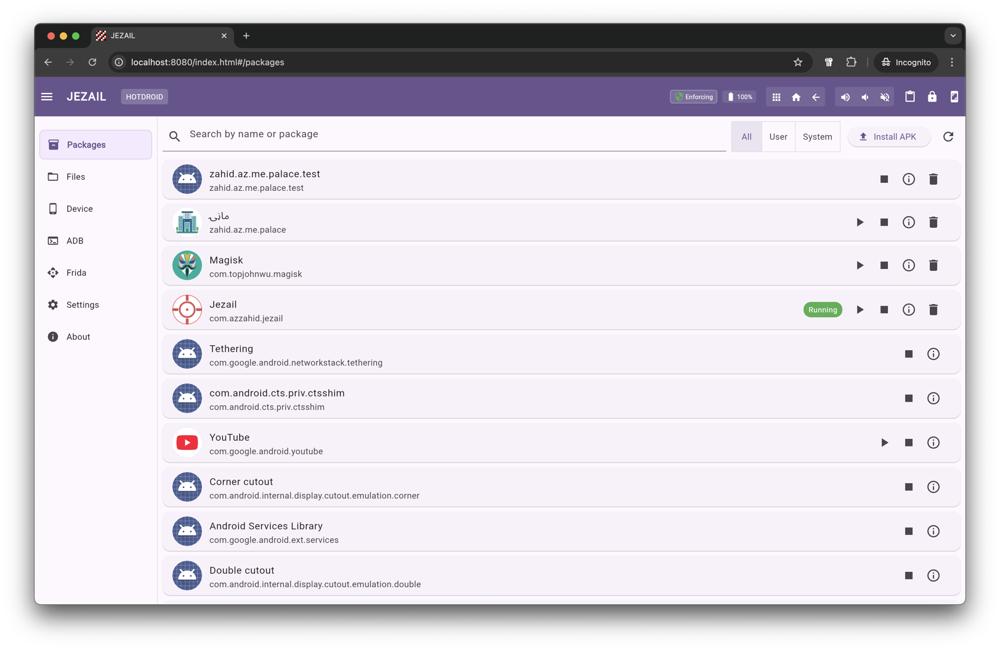
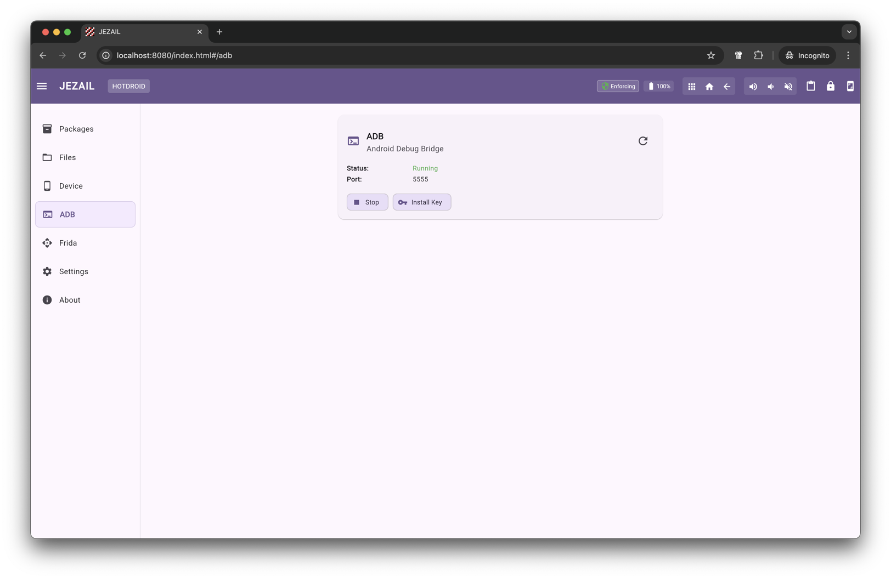

<div align="center">
  <br>

  

  <br>
  <br>

  <p>
    <strong>Android Pentesting Toolkit</strong><br>
    <em>Transform your rooted device into a full security testing platform</em>
  </p>

  <p>

  [](LICENSE)
  [](https://developer.android.com)
  [](https://github.com/topjohnwu/Magisk)
  [](https://kotlinlang.org)
  [](https://ktor.io)

  </p>

  <p>

  [](https://github.com/zahidaz/jezail/stargazers)
  [](https://github.com/zahidaz/jezail/issues)
  [](https://github.com/zahidaz/jezail/commits)
  [](https://github.com/zahidaz/jezail)

  </p>

</div>

---

Jezail is an all-in-one Android application that runs entirely on your rooted device. It exposes a rich **REST API** and serves an embedded [**web interface**](./UI.md), accessible from any browser on your network, giving you remote control over device management, system internals, and security tooling without any external dependencies.

## Features

<table>
<tr>
<td width="50%">

### Device Control
- Hardware info, battery, CPU, RAM, storage
- Screenshot capture & screen mirroring (WebSocket)
- Clipboard read/write/clear
- Hardware key simulation
- System properties & SELinux toggle
- Environment variables, proxy & DNS config

</td>
<td width="50%">

### Application Management
- List, install, uninstall packages
- Launch/stop apps with activity options
- Permissions management (grant/revoke)
- App ops configuration
- Debug status, signatures, process info
- Clear app data and cache

</td>
</tr>
<tr>
<td width="50%">

### Security Tools
- **Frida** server management & auto-install
- **ADB** server control & key management
- Certificate management (system/user)
- APK download, backup & XAPK install
- PIN-based auth with Bearer tokens
- **Refrida** Web IDE for live instrumentation

</td>
<td width="50%">

### System & Monitoring
- Log buffers (main, kernel, radio, crash, events)
- Live logcat streaming via WebSocket
- File system browsing with chmod/chown/chgrp
- File upload, download & directory zip
- Process listing & management
- Web-based terminal (xterm.js)

</td>
</tr>
</table>

## Quick Start

### Prerequisites

- **Rooted Android device** - [Magisk](https://github.com/topjohnwu/Magisk) recommended
- For emulators - [rootAVD](https://gitlab.com/newbit/rootAVD)

### Install

<div align="center">
  <a href="https://github.com/zahidaz/jezail/releases">
    
  </a>
  <br><br>
  <a href="https://github.com/zahidaz/jezail/releases">
    
  </a>
  <br>
  <sub>Scan to download from Releases</sub>
</div>

<br>

```bash
adb install -g -r jezail.apk
```

Launch the app. The HTTP server starts automatically on port **8080**.

### Access

| Endpoint | Description |
|----------|-------------|
| `http://<device-ip>:8080/` | Web UI |
| `http://<device-ip>:8080/terminal` | Web Terminal |
| `http://<device-ip>:8080/mirror` | Screen Mirror |
| `http://<device-ip>:8080/refrida/` | Refrida IDE |
| `http://<device-ip>:8080/api/swagger` | Swagger Docs |
| `http://<device-ip>:8080/api/json` | OpenAPI JSON |

> [!TIP]
> **Running on an emulator?** Forward the port first: `adb forward tcp:8080 tcp:8080` then use `localhost:8080`

## API

Jezail exposes a complete REST API with OpenAPI documentation. Every feature available in the web UI is accessible programmatically.

```bash
curl http://<device-ip>:8080/api/device

curl http://<device-ip>:8080/api/device/screenshot -o screen.png

curl http://<device-ip>:8080/api/packages

curl http://<device-ip>:8080/api/frida
```

Full interactive documentation at `/api/swagger`.

## Screenshots

<div align="center">
  
  
  
</div>

<details>
<summary><strong>More screenshots</strong></summary>
<br>
<div align="center">
  
  
  
  
  
</div>
</details>

## Contributing

Contributions are welcome. Open an issue or submit a pull request.

## About the Name

The **Jezail** (جزایل) is a handcrafted long-barreled rifle from Afghanistan, renowned in 19th-century warfare for its exceptional range and precision. Its distinctive curved stock allowed marksmen to fire accurately from any position, whether standing, kneeling, or mounted on horseback. In battle, it consistently outranged contemporary military firearms, giving its wielders a decisive tactical advantage.

This toolkit carries the same philosophy: **precise, powerful, and effective at a distance**, delivering deep system-level control to your Android device from anywhere on the network.

> [!WARNING]
> Jezail is under active development and provided **as-is** without warranty. It is intended for authorized security testing and educational purposes only. Users assume full responsibility for how they use this toolkit.

## License

[MIT License](./LICENSE) - Copyright (c) 2025 Xahid
